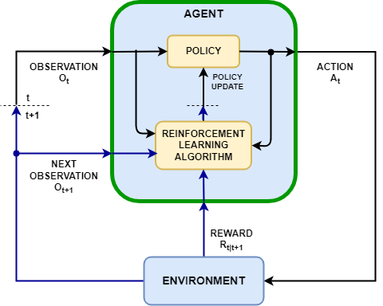
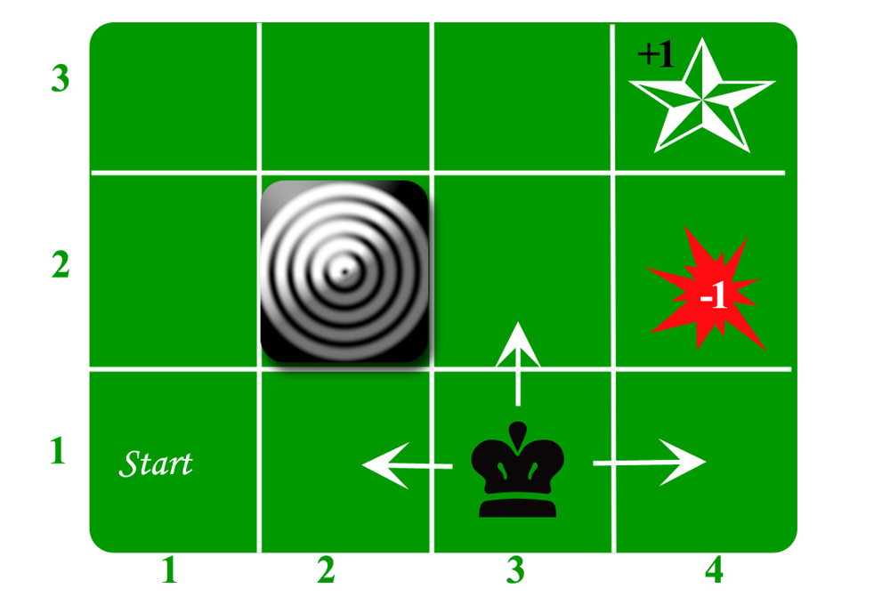

# Reinforcement Learning: Basic Concepts and Foundations

## Reinforcement Learning (Basic Concepts and Motivation)

> “The reinforcement learning problem is meant to be a straightforward framing of the problem of learning from interaction to achieve a goal.”
> — Richard S. Sutton and Andrew G. Barto, *Reinforcement Learning: An Introduction*

Reinforcement Learning (RL) is a paradigm of machine learning concerned with learning through interaction. An **agent** (the learner/decision‑maker) interacts with an **environment** (everything the agent encounters outside itself) in discrete time steps, with the objective of maximizing a cumulative reward signal. Unlike supervised learning, there is no explicit “correct answer” for each situation; instead, the agent must discover good behavior by trial and error. This makes RL fundamentally about sequential decision‑making – the agent’s actions influence not just immediate rewards but also future states and rewards.

At each time step *t*, the agent–environment interaction follows a cycle:

1. The agent observes the current state $S_t$ of the environment.
2. Based on this state, the agent chooses an action $A_t$ to perform (according to some strategy or **policy**).
3. The environment responds by giving the agent a reward $R_{t+1}$ (a numerical feedback signal) and transitioning to a next state $S_{t+1}$.

This loop then repeats at $t+1$, continuing over a sequence of time steps (an episode may end when a terminal state is reached). The goal of the agent is to learn a policy for selecting actions that maximizes the long‑term sum of rewards it receives.



**Figure:** *The agent–environment interaction in reinforcement learning.* The agent perceives the current state $S_t$, takes an action $A_t$, and in return the environment produces a reward $R_{t+1}$ and a new state $S_{t+1}$. The agent’s policy (decision‑making rule) is updated over time by a learning algorithm to improve performance. The objective is to maximize the cumulative reward over time through this trial‑and‑error process.

> **Note (Exploration vs. Exploitation):**
> RL agents must make a trade‑off between exploration and exploitation. Unlike in supervised learning, an RL agent is not guided with correct actions; it must explore different actions to discover which yield higher rewards, while also exploiting known rewarding actions to accumulate reward. Managing this balance (trying new actions vs. using current knowledge) is crucial for maximizing the cumulative reward, and is known as the *exploration–exploitation dilemma*.

In practice, we typically formalize the environment in RL using the framework of a **Markov Decision Process (MDP)**. The MDP provides a mathematical foundation for the states, actions, rewards, and their dynamics, which we detail next.

---

### Markov Decision Processes (MDPs)

A Markov Decision Process (MDP) is a mathematical model for sequential decision‑making, defined by the tuple $(S, A, P, R, \gamma)$. The components of an MDP are:

* **State Space $(S)$:** The set of all possible states in the environment. A state $s \in S$ captures the relevant configuration of the agent and environment at a time. (States can be discrete or continuous.)
* **Action Space $(A)$:** The set of actions available to the agent. In state $s$, the agent may choose any $a$ from the set of allowed actions $A(s) \subseteq A$ for that state.
* **Transition Probability $(P)$:** The state‑transition dynamics, defining the probability of moving to a new state given the current state and action. Formally, $P(s' \mid s,a)$ gives the probability that the environment will transition to state $s'$ if the agent takes action $a$ in state $s$. (This is sometimes written as a function $T(s,a,s') = \Pr(S_{t+1}=s' \mid S_t=s, A_t=a)$.)
* **Reward Function $(R)$:** A function that defines the immediate reward received after transitions. For example, $R(s,a,s')$ is the numerical reward gained when the agent moves from state $s$ to state $s'$ by taking action $a$. Rewards can be positive (reinforcing) or negative (punishing), and the agent’s objective is to maximize the total reward over time.
* **Discount Factor $(\gamma)$:** A factor $0 \le \gamma < 1$ that determines the present value of future rewards. A $\gamma$ close to 1 means future rewards are highly valued, whereas a smaller $\gamma$ makes the agent short‑sighted (valuing immediate rewards more).

> **Important (Markov Property):**
> MDPs assume the *Markov property*: the effect of an action on the next state depends **only** on the current state and action, not on the history of past states. In other words, given the present state $s$ and action $a$, the next state $s'$ (and reward) is conditionally independent of all earlier states. This memoryless property implies that all relevant information from the history is encapsulated in the current state $s$.

An MDP provides a formal and tractable way to model the RL environment. Many real‑world scenarios can be modeled as MDPs. Fully observable environments satisfy the Markov property by definition (the state represents all information needed for future dynamics). If the agent cannot directly observe the true state, the task can be modeled as a Partially Observable MDP (POMDP), but we will assume full observability here.



**Figure:** *A simple Grid‑World example of an MDP.* Each cell in the grid is a state. The agent starts in the bottom‑left cell. It can take actions to move **Up**, **Down**, **Left**, or **Right**. Some cells yield special rewards: the goal (⭐) gives a reward of +1 upon entering, while the hazard (💥) gives –1. The gray square is an obstacle (no entry). If the agent walks into a wall or obstacle, it remains in the same cell. This environment can be formalized as an MDP with states = grid cells, actions = moves, transition probabilities mostly deterministic (e.g. 80 % move intended direction, 20 % stay put for a slippery‑floor variant), and a reward function defined by the grid (+1, –1, or 0 per move). The task is episodic (ends upon reaching goal or falling into hazard), and the agent’s aim is to find a policy that navigates to the goal while avoiding the hazard.

---

## Policy

A **policy** $\pi$ defines the agent’s way of behaving at a given time. It is essentially the agent’s strategy for choosing actions. Formally, a policy is a mapping from states to a probability distribution over actions. We denote $\pi(a \mid s)$ as the probability that policy $\pi$ selects action $a$ in state $s$.

### Deterministic Policies

A deterministic policy chooses a definite action for each state. For example, in a grid‑world an agent might have a policy that says “if in state (3, 2), move *Right*.” In formal terms, a deterministic policy $\pi$ is a function that yields a single action $a = \pi(s)$ for each state $s$. Deterministic policies are simpler to execute, but in some cases a deterministic policy might be suboptimal or can lead to poor exploration. Nonetheless, for any finite MDP, there exists an optimal policy that can be taken to be deterministic and stationary (time‑independent).

> **Note:** In MDP theory, one can show it is sufficient to consider *stationary* policies (policies that depend only on the current state, not on time or history) and even restrict to deterministic ones for finding an optimal solution. This is a consequence of the Markov property and the principle of optimality.

### Stochastic Policies

A stochastic policy specifies a probability distribution over actions for each state. In state $s$, the agent randomizes its action choice according to $\pi(\cdot \mid s)$. For example, $\pi(a_1 \mid s)=0.7$ and $\pi(a_2 \mid s)=0.3$ means the agent will choose action $a_1$ 70 % of the time and $a_2$ 30 % of the time when in state $s$. Such policies are useful for exploration (ensuring a variety of actions are tried). They are also necessary in environments where randomness can yield higher long‑term rewards or when the optimal solution itself is stochastic (e.g. in competitive games or partially observable settings).

Stochastic policies generalize deterministic ones: a deterministic policy can be seen as a special stochastic policy concentrated on a single action per state. In RL algorithms, policies are often initialized as stochastic (sometimes even purely random) and gradually become more deterministic as the agent learns which actions are best.

---

## Value Function (State‑Value Function)

In reinforcement learning, we are interested in predicting the expected **return** — the total accumulated reward — from states. A **value function** assigns to each state (or state‑action pair) a numeric value representing the goodness or utility of being in that state (or performing that action). Formally, the state‑value function for a policy $\pi$, denoted $V^\pi(s)$, is the expected return when starting in state $s$ and following policy $\pi$ thereafter.

First, let’s define the **return** from time $t$ as the random variable representing the total discounted reward from that point onward:

```math
G_t \;=\; R_{t+1} + \gamma R_{t+2} + \gamma^2 R_{t+3} + \dots \;=\; \sum_{k=0}^{\infty} \gamma^k R_{t+k+1},
```

where $0 \le \gamma < 1$ is the discount factor.

Using the return, the state‑value function is defined as the expected return starting from state $s$ under policy $\pi$:

```math
V^\pi(s) \;=\; \mathbb{E}\!\Bigl[G_t \,\big|\, S_t = s,\; \text{following } \pi \Bigr]
           \;=\; \mathbb{E}_\pi\!\Bigl[ \sum_{k=0}^{\infty} \gamma^k R_{t+k+1} \,\Big|\, S_t = s \Bigr].
```

Roughly speaking, the value function $V^\pi(s)$ measures “how good it is” to be in state $s$ under policy $\pi$. It satisfies an important recursive relationship called the **Bellman equation**. Noting that after the first step from state $s$, the remaining return is just $G_{t+1}$:

1. At time $t$ in state $s$, $G_t = R_{t+1} + \gamma G_{t+1}$.
2. Taking expectation conditioned on $S_t=s$:
   $V^\pi(s) = \mathbb{E}[R_{t+1} + \gamma G_{t+1} \mid S_t=s]$.
3. But $\mathbb{E}[G_{t+1} \mid S_{t+1}=s'] = V^\pi(s')$, so
   $V^\pi(s) = \mathbb{E}[R_{t+1} + \gamma V^\pi(S_{t+1}) \mid S_t=s]$.

> **Bellman Expectation Equation (Policy Evaluation):**
> For any policy $\pi$ and any state $s$,
>
> ```math
> V^\pi(s) = \mathbb{E}\!\bigl[ R_{t+1} + \gamma\,V^\pi(S_{t+1}) \,\big|\, S_t = s \bigr].
> ```
>
> In discrete form:
>
> ```math
> V^\pi(s) = \sum_{a\in A} \pi(a\mid s) \sum_{s'\in S} \sum_{r} P(s',r \mid s,a)\,\bigl[ r + \gamma\,V^\pi(s') \bigr].
> ```

Once $V^\pi(s)$ is known for all states, it tells us how well policy $\pi$ is doing. Value functions are central to many RL algorithms, which often work by iteratively improving an initial policy using value‑function estimates (e.g., *policy iteration* alternates policy evaluation and improvement).

---

## Action‑Value Function (Q‑Function)

While $V^\pi(s)$ gives the value of states under a policy, it is often useful to know the value of taking a specific action in a state. This is captured by the **action‑value function**, commonly called the **Q‑function**. The Q‑function for policy $\pi$ is denoted $Q^\pi(s,a)$ and is defined as the expected return starting from state $s$, taking action $a$, and thereafter following policy $\pi$:

```math
Q^\pi(s,a) \;=\; \mathbb{E}\!\bigl[ G_t \,\big|\, S_t = s,\, A_t = a,\; \text{follow }\pi \text{ thereafter} \bigr].
```

In essence, $Q^\pi(s,a)$ quantifies “how good it is” to choose action $a$ in state $s$ under policy $\pi$. There is a direct relationship between $Q^\pi$ and $V^\pi$:

```math
V^\pi(s) \;=\; \sum_{a\in A} \pi(a\mid s)\,Q^\pi(s,a).
```

If $\pi$ is deterministic, then $V^\pi(s) = Q^\pi(s,\pi(s))$.

A recursive Bellman equation for $Q^\pi$ is obtained by reasoning on the first step:

```math
Q^\pi(s,a) = \mathbb{E}\!\bigl[ R_{t+1} + \gamma\,V^\pi(S_{t+1}) \,\big|\, S_t=s, A_t=a \bigr].
```

Since $V^\pi(S_{t+1}) = \sum_{a'} \pi(a' \mid S_{t+1})\,Q^\pi(S_{t+1},a')$, we also have

```math
Q^\pi(s,a) = \mathbb{E}\!\bigl[ R_{t+1} + \gamma\,Q^\pi(S_{t+1}, A_{t+1}) \,\big|\, S_t=s, A_t=a \bigr],
```

where $A_{t+1} \sim \pi(\cdot \mid S_{t+1})$.

> **Note:** The “Q” in Q‑function stands for *quality*. The Q‑value $Q^\pi(s,a)$ reflects the quality (expected utility) of taking action $a$ in state $s$ under policy $\pi$. Higher $Q$ means that action is predicted to lead to greater returns.

In the special case of an **optimal policy** $\pi^*$, we define

* $V^*(s) = \max_\pi V^\pi(s)$ and
* $Q^*(s,a) = \max_\pi Q^\pi(s,a)$.

$Q^*(s,a)$ gives the best possible expected return achievable from state $s$ with action $a$ (assuming optimal behavior thereafter). An optimal policy $\pi^*$ can be obtained directly from $Q^*$ by choosing, in each state, the action with the highest $Q^*$ value:

```math
\pi^*(s) \;=\; \arg\max_{a \in A} Q^*(s,a).
```

---

Having introduced these core concepts — **MDPs**, **policies**, and **value functions** ($V$ and $Q$) — we have the foundation to understand reinforcement‑learning methods. In summary, an RL agent uses experience to estimate value functions and/or a policy, and uses those estimates to improve its behavior. The state‑value function $V^\pi$ evaluates how good states are under a policy, the action‑value function $Q^\pi$ evaluates how good state‑action choices are, and the policy $\pi$ directs the agent’s actions. Together, these elements and equations (Bellman equations) form the backbone of reinforcement‑learning theory and algorithms.

---
